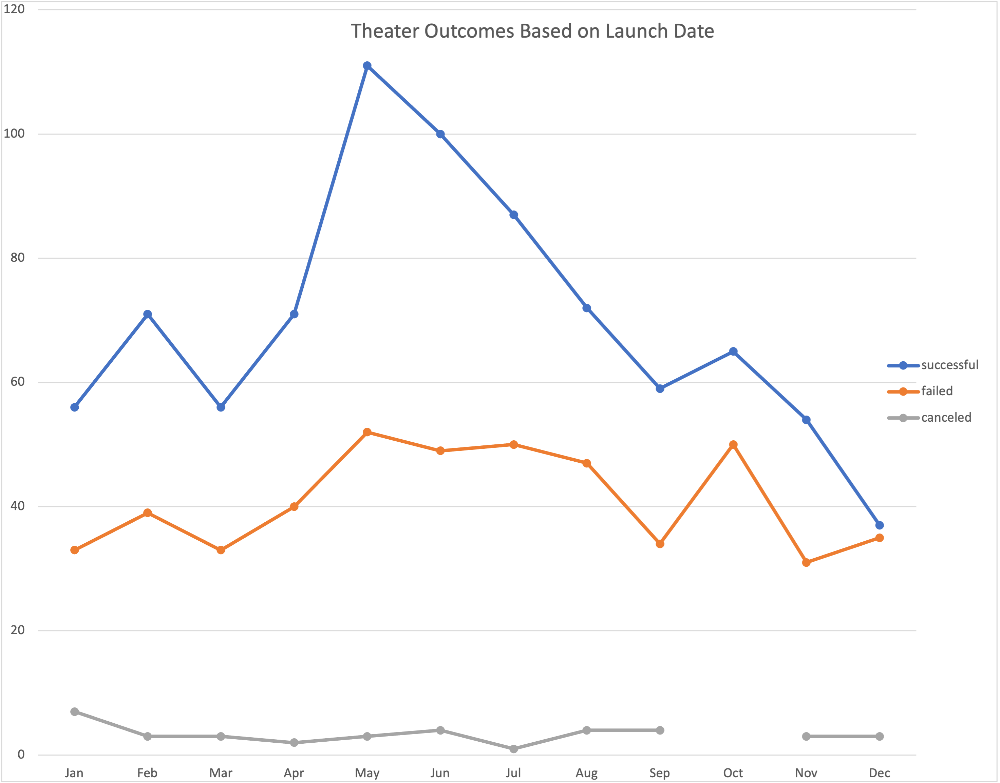
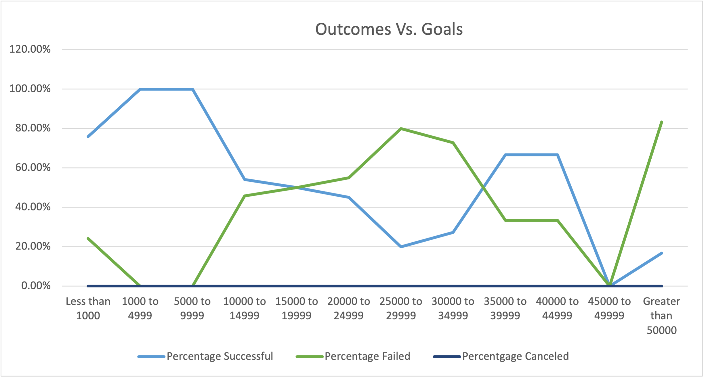

# Excel Theater Kickstarter Outcomes Analysis

## Overview of Project
### This project involved analyzing data from various kickstarter campaigns for several genres of entertainment.

### Purpose
#### The purpose of the analysis was to specifically identify campaign outcomes for theater kickstarters, based on launch date and fundraising goals.

## Analysis and Challenges
The first part of the analysis was to add columns to the main Kickstarter sheet so that were able to get data on theater outcomes and compile tables and graphs for Outcomes Based on Launch Date as well as Outcomes Based on Goals. 

### Analysis of Outcomes Based on Launch Date

### Analysis of Outcomes Based on Goals

### Challenges and Difficulties Encountered
Thankfully this activity was straightforward and getting the right formulas input to gather the data was simple. 

## Results

- What are two conclusions you can draw about the Outcomes based on Launch Date?
Two conclusions I can draw about Outcomes based on Launch date are April - June are the best times for a Theater production to launch, with May representing the high point. This is probably a result of people having more disposable income toward the beginning part of the year. The other conclusion I can draw is the latter part of the year is the low point for not only successful launches, but total launches. September - December are also months where people are focused on holidays and have less disposable income. 

- What can you conclude about the Outcomes based on Goals?
From the Outcomes based on Goals, I can conclude most theater productions don't cost much and, therefore, have a higher chance of success. This also bears out in the Parent Categories Outcomes chart. 

- What are some limitations of this dataset?
Some limitations of this dataset are not being able to determine what each play is expected to make in terms of ticket sales. It's easy to conclude lower budgeted productions are more successful. But they also may not be for huge venues with a higher ticket price. Whereas those successful productions in the 35000 - 44999 range might be bringing in a lot more money, given that their fundraising goal is much higher. 

- What are some other possible tables and/or graphs that we could create?
We could create a table/graph to show outcome based on the lengths of the Kickstarter campaigns. That way we can get an idea of how Outcome, amount, and launch success/failure relative to length of time the Kickstarter ran. 
